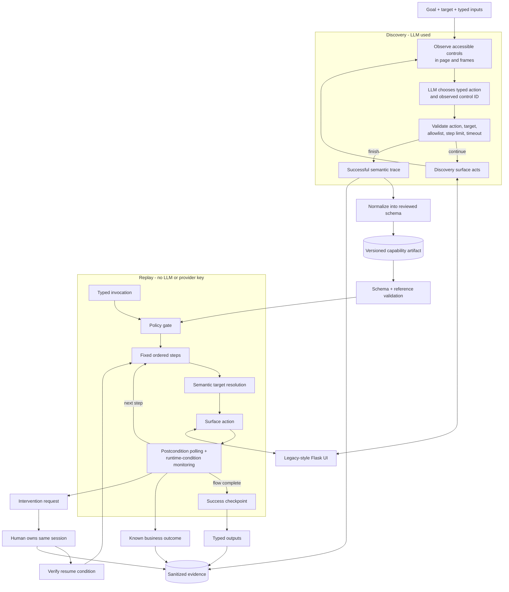

# 1. Architecture

Understudy implements one end-to-end vertical slice: an LLM operates a live,
synthetic banking UI once, the successful trace is compiled into a typed
capability, and later invocations replay that capability without a model. The
Flask target deliberately resembles a legacy system: server-rendered pages,
an iframe, tables, opaque field names, and no test IDs. Python, Pydantic,
Playwright, and a synchronous single-process design keep the important control
flow inspectable. Production workers would be durable jobs, but queues and
services would not improve the abstractions being evaluated here.

`Surface` is the main boundary. The engines know semantic operations such as
resolve, activate, read, and press key; only `PlaywrightWebSurface` knows web
locators. Discovery is separate because it is probabilistic: each observation
gets ephemeral control IDs, and the model must answer through a discriminated
tool schema. Code, not the model, supplies values and enforces the expected
workflow grammar. This is intentionally constrained discovery rather than a
claim of general browsing autonomy.

# 2. Artifact schema

The artifact is a strict, versioned Pydantic contract. It declares capability
identity and approval state; app family and compatible versions; parameterized
routes and runtime bindings; typed inputs and outputs with sensitivity rules;
surface contexts; reusable targets; runtime conditions; ordered steps; a final
checkpoint; policy; and provenance. Unknown fields and dangling references are
rejected. References inside actions, conditions, locator strategies, and route
templates are checked before execution, as are unique IDs, declared parser
outputs, primary strategies, and action-target roles.

Locator strategies are discriminated unions, not bags of optional fields.
Accessibility role/name is preferred, followed by controlled text, attribute,
CSS, or relational-table fallbacks. Table relations explicitly separate
column-value and row-label matching, and descendant-action and cell selection.
This prevents invalid combinations and avoids row indexes that can silently
return the wrong account. A fallback reports `degraded`; ambiguity or failure
does not choose an arbitrary element. Detection targets allow zero-or-one
matches because absence is their normal state, while actionable targets must
resolve uniquely.

`surface_contexts` are resolvable objects rather than string frame paths. Every
target inside the legacy iframe references one context, so a single override
could repair the frame for a different tenant or version. A step combines
intent, one typed action, risk, precondition, postcondition, timeout, and retry
policy. Retries can repeat an action only when it is declared idempotent. The
hand-authored artifact remains the permanent reviewed test fixture; the
discovery-generated artifact is separate proof of a real run.

# 3. Determinism & error handling

Replay validates the complete invocation and embedded policy before opening
the flow. It rejects unknown or malformed inputs and runtime bindings, routes
outside allowed origins, disallowed actions, excessive steps/runtime, and risk
classes requiring confirmation. It then executes the artifact's fixed step
order through the surface adapter. No provider object is constructed. An E2E
test removes both provider keys before replay, and replay evidence records
`model_in_decision_loop: false`.

Every action is bracketed by conditions. The waiter polls within the smaller of
the step and run budgets and checks runtime conditions during polling, when
loading or error UI is actually visible. The taxonomy is executable:
`MEMBER_NOT_FOUND` returns a typed business outcome, `TRANSIENT_LOADING` uses a
bounded recovery wait, `SESSION_EXPIRED` raises an intervention, and
`APPLICATION_ERROR` is a hard failure. Retrying an action is distinct from
continuing to wait after an action already completed. The final checkpoint
independently verifies the displayed member and the declared output types.

Success and business outcomes are returned as structured results. Failures use
typed exceptions and the CLI serializes step, attempt, condition, and category
metadata. Failure evidence includes a redacted screenshot and withholds raw
exception text; parser errors never embed the financial source value.

# 4. Heterogeneity & multi-tenant

The artifact describes semantic intent while a `Surface` implementation owns
perception and interaction. A desktop adapter could map accessibility
strategies to OS role/name queries, contexts to windows or panes, and the same
actions to UI Automation or macOS Accessibility. A screenshot adapter could
add an image-anchor strategy without changing step execution, policies,
conditions, or result contracts.

Reuse should be keyed by `app_family + compatible_app_versions`, not copied per
institution. A reviewed base artifact would contain common steps and semantic
targets. Narrow tenant/version profiles could override origins, route
templates, contexts, and strategy ordering at named schema-validated extension
points; they must not silently replace steps or widen policy. Target-resolution
telemetry supplies the drift loop: primary success means healthy reuse,
repeated fallback use proposes an override, and ambiguity or failure
quarantines unattended execution until review.

# 5. Escalation & handoff

Runtime monitoring detects the artifact-declared expired-session marker and
raises an intervention carrying the condition code, capability, goal, current
step, and reason. `ReplayEngine` accepts an intervention handler; without one
it stops and the CLI captures failure evidence. The demo supplies a real
handler that adds a screenshot and pauses inside the same engine wait,
preserving the Playwright page, browser context, cookies, frame, and current
step.

`HandoffSession` is an explicit ownership lease: exactly one of `automation` or
`human` owns control. The local operator receives the headed browser, performs
the manual resume action, and signals completion. A signal is insufficient on
its own: the artifact's resume condition must pass before ownership returns.
The same replay then continues to its final checkpoint. Before/after
screenshots, ownership transfers, privacy-safe human click/input metadata, and
the resumed replay result are stored in one handoff record; input values are
never captured. The terminal prompt is a deliberately minimal operator UI.

# 6. Safety

Policy is data in the artifact and is enforced before replay; discovery also
validates its target entry route, input contract, and required actions before
navigation. Models can choose only fresh observed control IDs and typed target
references. They cannot provide selectors, URLs, code, or runtime values, and
page content is explicitly treated as untrusted. The sample capability allows
only read and reversible input actions; irreversible actions require human
confirmation and therefore cannot run unattended.

Inputs are validated and never stored in evidence. Artifacts contain parameter
references rather than invocation values. Financial outputs remain return-only
and are redacted from traces and screenshots; raw model transcripts, secrets,
tokens, and arbitrary exception text are not persisted. The remaining
production limit is important: artifact policy must be intersected with a
separately administered tenant policy and browser-level network egress. Real
screenshot storage would also require masking, encryption, access control, and
retention rules.

# 7. Cuts

I cut breadth, not required seams. Discovery handles one known workflow and two
providers; the operator UI is a headed browser plus terminal; desktop and
tenant overrides are designed but not implemented. I did not build queues,
distributed workers, a capability catalog API, signing, a co-browsing console,
or model fallback during replay. Next I would add external policy intersection
and signed approved artifacts, then tenant/version overrides with resolution
telemetry, and finally an authenticated operator queue with expiring leases.
